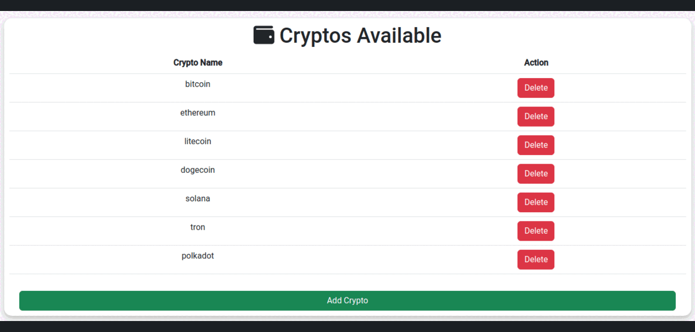

# **Investospehere**

## **Overview**

Investosphere is a virtual investment platform that allows users to simulate
and plan their cryptocurrency investments without using real money. It provides
a safe and risk-free environment for users to practice and experiment with
various investment strategies in the cryptocurrency market.

[Investosphere Live Website](https://investosphere-d74500c2a8ca.herokuapp.com/) (
Right-click to open in a new tab)

## **Project Goals**

This is my fourth portfolio project, showcasing my proficiency in web
development frameworks like Bootstrap and Django. My objective with this
project is to demonstrate how I can leverage these skills effectively. I have
chosen to create a cryptocurrency-focused website that integrates with
real-time market data using external APIs.

The website will serve as a platform for users to explore, simulate, and plan
cryptocurrency investments without using real money. It aims to provide a safe
and educational environment for users to develop and refine their investment
strategies. This project reflects my commitment to combining technical
expertise with real-world applications, offering users a valuable tool for
cryptocurrency investment planning and education.

## **Contents**

- [**UX**](#ux)
- [**The Strategy Plane**](#the-strategy-plane)
- [**The Ideal User**](#the-ideal-user)
- [**Site Goals**](#site-goals)
- [**Agile Planning**](#agile-planning)
- [**The Skeleton Plane**](#the-skeleton-plane)
  - [**Wireframes**](#wireframes)
  - [**Database Schema**](#database-schema)
  - [**Security Measures**](#security-measures)
- [**The Scope Plane**](#the-scope-plane)
- [**The Structure Plane**](#the-structure-plane)
  - [**Features**](#features)
    - [**Navbar**](#navbar)
    - [**Footer**](#footer)
    - [**Homepage**](#homepage)
    - [**Register Page**](#register-page)
    - [**Login Page**](#login-page)
    - [**Wallet Page**](#wallet-page)
    - [**Crypto Page**](#crypto-page)
    - [**Chart Page**](#chart-page)
    - [**Manage Page**](#manage-page)
    - [**Error Page**](#error-page)
    - [**Mobile View**](#mobile-view)
- [**Future Features**](#future-features)
- [**The Surface Plane**](#the-surface-plane)
  - [**Design**](#design)
    - [**Colour Scheme**](#colour-scheme)
    - [**Typography**](#typography)
  - [**Imagery**](#imagery)
- [**Technologies Used**](#technologies-used)
  - [**Languages Used**](#languages-used)
  - [**Frameworks and Tools Used**](#frameworks-and-tools-used)
  - [**APIs**](#apis)
  - [**Others**](#others)
  - [**Libraries Used**](#libraries-used)
- [**Testing**](#testing)
- [**Deployment**](#deployment)
  - [**Run locally**](#run-locally)
  - [**Heroku Deployment**](#heroku-deployment)
- [**Credits**](#credits)
- [**Acknowledgements**](#acknowledgements)

## **UX**

## **The Strategy Plane**

Investosphere aims to unite cryptocurrency enthusiasts, providing them with a
platform to explore the world of cryptocurrencies comprehensively. Users will
have the opportunity to simulate cryptocurrency investments, access market
data, and refine their investment strategies. They can review and analyze
crypto trends, create and manage virtual portfolios, and gain insights into the
cryptocurrency market.

The platform's user-friendly design and visually appealing interface ensure an
engaging and educational experience for users as they navigate the world of
cryptocurrency investments. The primary goal is to empower users with the
knowledge and tools they need to make informed investment decisions, all in a
risk-free and supportive environment.

### **The Ideal User**

- Enthusiasts of cryptocurrencies and blockchain technology.
- Individuals interested in exploring cryptocurrency investments.
- Users looking to gain practical experience in cryptocurrency trading without
  using real money.
- Those who want to build and refine their cryptocurrency investment
  strategies.
- Users seeking to access market data and stay informed about cryptocurrency
  trends.
- Investors who value a secure and risk-free environment for investment
  planning and education.
- Individuals who want to create and manage virtual cryptocurrency portfolios.
- Users who enjoy analyzing crypto market data and making informed investment
  decisions.
- Anyone looking to engage with a community of like-minded cryptocurrency
  enthusiasts for sharing insights and experiences.

### **Site Goals**

- To offer users a platform to explore cryptocurrencies, both familiar and new.
- To enable users to simulate cryptocurrency investments and gain hands-on
  experience.
- To empower users with the tools to refine their cryptocurrency investment
  strategies.
- To provide users with access to real-time cryptocurrency market data.
- To create a secure and risk-free environment for cryptocurrency investment
  planning and education.
- To facilitate the creation and management of virtual cryptocurrency
  portfolios.
- To support users in making informed investment decisions based on data and
  analysis.

- [Back to top &uarr;](#contents)

## **Agile Planning**

This project was developed using agile methodologies, focusing on delivering
small features across the project's duration. User Stories were prioritized
under the labels "Must Have," "Should Have," and "Could Have."

This approach ensured that all essential requirements were addressed initially,
providing a comprehensive foundation for the project. In certain cases, some "
Could Have" features were implemented ahead of schedule, particularly if they
were straightforward, such as Trending/Top Rated Movies. Other features were
integrated based on available capacity and timing.

The project utilized a Kanban board created on GitHub projects, which can be
accessed [here](https://github.com/users/Danvm94/projects/4). This board
provided detailed information about project cards. All User Stories included a
set of acceptance criteria to define the functionality required for story
completion.

## **The Skeleton Plane**

#### **Wireframes**

For this project, wireframes were created using Balsamiq. While wireframes were
developed primarily for the home page, the design for other pages naturally
evolved from the base.html template and certain elements of the home webpage.

The wireframes served as a visual guide to outline the layout and structure of
the home page, providing a clear representation of the overall design and user
interface. This approach allowed for flexibility in designing additional pages,
ensuring consistency in the user experience throughout the project.

Desktop

mobile

#### **Database Schema**

The database schema for this project includes the following models:

- The **Crypto** model stores information about cryptocurrencies.
    - Fields:
        - `name`: CharField for storing the name of the cryptocurrency (
          unique).
- The **Wallet** model represents user wallets, linked to the built-in User
  model. Each wallet contains information about the user's available dollars,
  and a timestamp of creation.
    - Fields:
        - `user`: One-to-One relationship with the User model.
        - `dollars`: Decimal field for storing dollar amounts.
        - `created_at`: Timestamp for creation.

- The **Cryptos** model represents cryptocurrency holdings of users, linked to
  the User model and the Crypto model. It stores information about the user's
  cryptocurrency holdings and the specific cryptocurrency's symbol.
    - Fields:
        - `user`: ForeignKey relationship with the User model.
        - `crypto`: ForeignKey relationship with the Crypto model.
        - `amount`: Decimal field for storing the cryptocurrency amount.
    - Additional Methods:
        - `formatted_amount`: Formats the cryptocurrency amount for display.
        - `symbol`: Property for retrieving the cryptocurrency's name.

- The **Transactions** model tracks user transactions, including deposits and
  withdrawals. It contains information about the user, transaction type,
  symbol, amount, and creation timestamp.
    - Fields:
        - `user`: ForeignKey relationship with the User model.
        - `type`: CharField for the transaction type.
        - `symbol`: CharField for the symbol (e.g., 'dollar').
        - `amount`: Decimal field for storing the transaction amount.
        - `created_at`: Timestamp for creation.
    - Additional Methods:
        - `formatted_amount`: Formats the transaction amount for display.

This schema defines the structure of your project's database, facilitating the
management of user wallets, cryptocurrency holdings, and transaction records.

#### **Security Measures**

Security is a top priority in the development of this project. Several security
measures have been implemented to protect user data and sensitive information.

- **User Authentication**

To ensure that only authorized users access certain views and functionalities,
the Django `@login_required` decorator has been applied. This means that
specific views can only be accessed by registered and authenticated users. If
an unauthenticated user attempts to access such views, they will be
automatically redirected to the login page.

- **Protection of Sensitive Data**

To safeguard secret keys, API keys, and other sensitive information,
environment variables have been utilized. During local development, these
variables are stored in an `env.py` file, ensuring that no confidential data is
exposed in the project repository. In the production environment (e.g., on
Heroku), these variables are securely managed through Heroku's config vars.

These security measures are in place to provide a safe and reliable user
experience while protecting sensitive information from unauthorized access.

[Back to top &uarr;](#contents)

### **The Scope Plane**

- **Responsive Design:** The site should be fully functional on all devices,
  ranging from 320px width and up.
- **Hamburger Menu:** Implement a mobile-friendly hamburger menu for improved
  navigation on mobile devices.
- **CRUD Functionality:** Users should have the ability to Create, Read,
  Update, and Delete wallet and cryptos.
- **Role-Based Access:** Implement role-based access control, allowing specific
  features like website's crypto manage for authorized users.
- **Home Page:** Design a home page that provides an overview of the site's
  purpose, with convenient links to essential features for registered users.

[Back to top &uarr;](#contents)

## **The Structure Plane**

### **Features**

#### **Navbar**

The Navbar contains links for various sections of the website, each with
specific visibility conditions:

- **Home** (index.html): Visible to all users.
- **Login** (login.html): Visible to all users.
- **Wallet** (wallet.html): Visible only to logged-in users.
- **Cryptos** (crypto.html): Visible only to logged-in users.
- **Chart** (chart.html): Visible only to logged-in users.
- **Manage** (manage.html): Visible only to logged-in users with staff
  privileges.

These navigation items ensure that users have access to the relevant sections
based on their authentication status and roles.

[Back to top &uarr;](#contents)

#### **Footer**

The footer section is thoughtfully positioned at the bottom of each page,
providing a cohesive and user-friendly experience.

- **Social Media Links:** Social media links are elegantly displayed using
  icons from Font Awesome. These icons offer a seamless way for users to
  connect with the developer, stay updated with news, and engage with the
  community.

- **Copyright/Disclaimer:** A concise portion of text serves as a Copyright and
  Disclaimer notice. It's the place where users can access essential
  information while interacting with the website.

[Back to top &uarr;](#contents)

#### **Homepage**

The homepage of Investosphere welcomes users with a well-structured layout
designed to provide a comprehensive experience. It's divided into three primary
sections:

- **'Welcome Section':** The "Welcome" section serves as the initial introduction
  to the website. It offers a brief and inviting overview of Investosphere's
  mission and purpose. This section sets the tone for the user's journey
  through the world of cryptocurrency investments.
  

- **'Market Cap Section':** In the "Market Cap" section, users gain access to
  market data. Here, the top market capitalization cryptocurrencies are
  prominently featured. Users can quickly assess the performance and trends of
  these cryptocurrencies, enabling informed decision-making for their
  investment strategies.
  

- **'Crypto News Section':** The "Crypto News" section provides users with
  up-to-date information and insights into the world of cryptocurrencies. It
  serves as a valuable resource for staying informed about market developments,
  trends, and news articles related to the cryptocurrency landscape.
  

[Back to top &uarr;](#contents)

#### **Register Page**

The 'Register' page on Investosphere is where new users can create their
accounts to access the platform's features. This user-friendly page simplifies
the registration process and gathers essential information from users to get
started.

#### **Login Page**

The 'Login' page is where registered users can securely access their accounts
on Investosphere. This page ensures that users can log in quickly and securely
to explore the platform's features and manage their investments.

#### **Wallet Page**

The Wallet page on Investosphere provides users with essential tools to manage
their financial transactions seamlessly. This page encompasses the following
primary functionalities: deposit, withdraw, transaction history.

- **Deposit Functionality:** The "Deposit" functionality empowers users to add
  funds to their wallet effortlessly. By inputting the desired amount of
  dollars and confirming the deposit, users can increase their financial
  resources. This feature ensures that users can conveniently top up their
  wallet to initiate cryptocurrency purchases.
  

- **Withdraw Functionality:** The "Withdraw" functionality allows users to make
  withdrawals from their wallet when needed. Users can specify the withdrawal
  amount, and upon confirmation, the requested funds are deducted from their
  wallet balance. This feature ensures flexibility and ease of access to funds
  for various financial needs.
  

- **Transaction History:** Alongside deposit and withdraw functions, the Wallet
  page also provides users with access to their transaction history. Users can
  review and track their financial activities, ensuring transparency and
  accountability in their financial management.
  

[Back to top &uarr;](#contents)

#### **Crypto Page**

The Crypto page on Investosphere is the user's gateway to cryptocurrency
investment and management. This multifaceted page offers essential features,
including buying, selling, and transaction history tracking.

- **Buy Cryptos:** The "Buy Cryptos" section empowers users to initiate
  cryptocurrency purchases. Users can select the cryptocurrency they wish to
  buy, specify the desired amount, and confirm the purchase. This feature
  ensures a seamless and secure process for acquiring cryptocurrencies within
  the platform.
  

- **Sell Cryptos:** The "Sell Cryptos" functionality allows users to sell their
  cryptocurrencies when they decide to liquidate their assets. Users can choose
  the cryptocurrency to sell, enter the amount they want to sell, and confirm
  the transaction. This feature provides flexibility and convenience for
  managing cryptocurrency holdings.
  

- **Transaction History:** The Crypto page also provides users with access to
  their transaction history, ensuring transparency and accountability. Users
  can review and track their cryptocurrency-related activities, including
  purchases and sales. This feature enables users to maintain a comprehensive
  record of their cryptocurrency transactions.
  

[Back to top &uarr;](#contents)

#### **Chart Page**

The Chart page on Investosphere offers users a dynamic and interactive view of
daily cryptocurrency prices. This page provides valuable insights into the
performance of various cryptocurrencies, allowing users to make informed
investment decisions.

- **Cryptocurrency Price Chart:** The centerpiece of the Chart page is the
  Cryptocurrency Price Chart. This interactive chart displays daily price data
  for each cryptocurrency available on the platform. Users can select specific
  cryptocurrencies to display or hide, tailoring the chart to their
  preferences.
  

- **Customization Options:** Investosphere's Chart page offers customization
  options to enhance the user experience. Users can choose which
  cryptocurrencies to include in the chart view, enabling them to focus on
  specific assets of interest. This feature empowers users to track the
  performance of their chosen cryptocurrencies with precision.
  

[Back to top &uarr;](#contents)

#### **Manage Page**

The 'Manage' page on Investosphere is a restricted area accessible only to
staff members. This specialized page empowers staff to maintain and manage the
cryptocurrency offerings available throughout the website. It offers two
essential functions:

- **Add New Cryptocurrency Availability:** Staff members can leverage the 'Add
  New Cryptocurrency' feature to introduce new cryptocurrencies to the
  platform. This functionality ensures that the website remains up-to-date with
  the latest crypto assets. Staff can provide essential information about the
  new cryptocurrency, making it available for users to explore, invest in, and
  track.
  

- **Delete Cryptocurrency from the Platform:** The 'Delete' function provides
  staff members with the capability to remove a cryptocurrency entirely from
  the platform. This action is irreversible and results in the removal of the
  crypto from all user wallets and transactions. The deleted cryptocurrency
  will disappear from the system permanently.
  

[Back to top &uarr;](#contents)

#### **Error Page**

The '404 Page' on Investosphere is designed to handle situations where users
attempt to access a page or resource that doesn't exist or can't be found. It
provides a user-friendly and informative experience in case of unexpected
errors.

#### **Mobile View**

Investosphere embraces a mobile-first approach to design, ensuring an
exceptional user experience on a wide range of devices, including smartphones
and tablets. The site seamlessly adapts to different screen sizes and
orientations, providing users with a consistent and user-friendly interface.
Bootstrap integration, media queries, and touch-friendly interactions enhance
mobile responsiveness.

Investosphere's commitment to mobile-first design and responsiveness guarantees
that users can comfortably access and navigate the platform on their preferred
devices, regardless of screen size.

### **Future Features**

**Additional Future Features**

1. **Crypto News Aggregator:** Implement a feature that aggregates and curates
   cryptocurrency news from various sources, providing users with a
   comprehensive overview of the latest developments in the crypto world.

2. **Cryptocurrency Converter:** Introduce a real-time cryptocurrency converter
   that allows users to quickly convert between different cryptocurrencies and
   fiat currencies, making it easier to assess the value of their holdings.

3. **Price Alerts:** Enable users to set price alerts for specific
   cryptocurrencies, notifying them when a cryptocurrency reaches a predefined
   price threshold, helping users make timely investment decisions.

4. **Enhanced Security Measures:** Continuously improve security measures, such
   as two-factor authentication (2FA), cold storage options, and security
   audits, to ensure the safety of users' funds and data.

5. **User Dashboard Customization:** Allow users to customize their dashboard
   with widgets and tools that align with their investment preferences,
   providing a personalized experience.

6. **Cryptocurrency Analysis Tools:** Develop advanced cryptocurrency analysis
   tools, including technical indicators, chart patterns, and historical data
   analysis, to support users in making data-driven investment choices.

7. **Money Pattern Implementation:** Implementing a "Money Pattern" that
   enhances the way users interact with their wallets and cryptocurrencies.

These future features can further elevate your website, making it a valuable
resource for cryptocurrency enthusiasts and investors.

[Back to top &uarr;](#contents)

## **The Surface Plane**

### **Design**

#### **Colour Scheme**

- `#F5F5F5` 
    - Background color for the entire website. Provides a clean and neutral
      backdrop for content.

- `#f0f0f0` 
    - Background color for specific containers, such as the registration form.
      Creates a subtle contrast and separation.

- `#181918` 
    - Background color used for specific elements, adding depth and contrast to
      the design.

- `#333` 
    - Text color for labels and elements, ensuring good readability.

- `#FFFFFF` 
    - Background color for containers like news sections, providing a clean and
      well-organized appearance.

- `#50c878` 
    - Button and accent color. Represents positive actions like confirmation
      and success.

- `#222` 
    - Background color for navigation links, creating a clear visual separation
      for navigation elements.

The color choices are simple yet meaningful, ensuring a cohesive and
user-friendly experience on your crypto website.

#### **Typography**

The primary font used throughout the website is **Roboto**, a clean and legible
sans-serif typeface. This font was chosen for its readability and modern
appearance, ensuring a pleasant reading experience for users.

- **Font Family**: "Roboto", sans-serif

The font choice enhances the overall aesthetics of the website, providing a
professional and user-friendly interface for visitors.

### **Imagery**

All the images used on this website have been sourced from
Freepik (www.freepik.com) and are available for free personal usage. These
images have been carefully selected to enhance the visual appeal and user
experience of the website. They are used in accordance with Freepik's licensing
terms, ensuring compliance with copyright and usage rights.

The images contribute to the overall aesthetics and functionality of the
website, providing users with a visually engaging and informative experience.

[Back to top &uarr;](#contents)

## **Technologies Used**

### **Languages Used**

)

### **Frameworks and Tools Used**

- 
    - Django was used as the main python framework in the development of this
      project
- 
    - Bootstrap played a crucial role in shaping the overall layout and
      ensuring consistent spacing across the website.
- 
    - ElephantSQL served as the Production database for this project.
- 
    - Cloudinary was employed to host and manage all static files and images
      for the project.
- 
    - Git was utilized for version control, allowing easy tracking of project
      changes for committing and pushing to GitHub.
- 
    - GitHub is the platform used to store the project's code after it's pushed
      from Git, facilitating version control and collaboration.
- 
    - Heroku was utilized for deploying the application.
-  -
  Balsamiq was utilized for creating wireframes for the website.
    - Balsamiq was utilized for creating wireframes for the website.
- 
    - CI Python Linter was employed to validate the website's Python code.
- 
    - DBDiagram was utilized to design and visualize the database schema.
- 
    - Chart.js, a powerful JavaScript library, is employed to create
      interactive charts on the website. These charts visualize cryptocurrency
      data, providing users with valuable insights into market trends and
      performance.
- 
    - Font Awesome, a comprehensive library of scalable vector icons, adds
      visual elements to the website. These icons enhance user experience and
      improve the overall design aesthetics.

### **APIs**

- 
    - The website's Crypto News section is powered by the News API, providing
      up-to-date news and insights on cryptocurrencies.

- 
    - CoinGecko, a trusted source for cryptocurrency data, is utilized to fetch
      cryptocurrency prices, market cap, and other essential information on the
      website.

### **Others**

- 
    - PyCharm, a powerful integrated development environment (IDE) for Python,
      was used throughout the project's development process. Its features and
      tools provided a smooth and efficient coding experience.

### **Libraries Used**

Libraries used for this project can be checked in
the [requirements](requirements.txt) file.

[Back to top &uarr;](#contents)

## **Testing**

For detailed information on testing post-development, please refer to
the [TESTING.md](TESTING.md) document.

## **Deployment**

### **Run locally**

- **Making a Local Clone**

1. Login or Sign Up to GitHub.
2. Open the project [repository](https://github.com/Danvm94/investosphere).
3. Click on the code button, select whether you would like to clone with HTTPS,
   SSH or GitHub CLI and copy the link shown.
4. Open the terminal in the code editor of your choice and change the current
   working directory to the location you want to use for the cloned directory.
5. Type 'git clone' into the terminal and then paste the link you copied in
   step
6. Press enter.

- **Forking the GitHub Repository**

    - To fork this website to either propose changes or to use as an idea for
      another website, follow these steps:

1. Login or Sign Up to GitHub.
2. Open the project [repository](https://github.com/Danvm94/investosphere).
3. Click the Fork button in the top right corner.
4. Copy of the repository will be in your own GitHub account.

- To deploy from GitHub, follow these steps:

1. Log into your GitHub repository, create a GitHub account if necessary.
2. Click 'Settings' in the main Repository menu.
3. Click 'Pages' from the left-hand side navigation menu.
4. Within the Source section, click the "Branch" button and change from 'None'
   to 'Main'.
5. The page should automatically refresh with an url displayed.
6. Test the link by clicking on the url.

### *Heroku Deployment*

Deployments steps are as follows, after account setup:

* Select New in the top-right corner of your Heroku Dashboard, and select
  Create new app from the dropdown menu.
* Add a unique app name and then choose a region closest to you (EU or USA).
* Click on Create App.

In order for the project to run on Heroku, Heroku is needed to install the
dependencies.

* In the terminal write the following commando `pip3 freeze > requirements.txt`
  to create a list of requirements. The list of dependencies will go
  into `requirements.txt` file.
* Further down, to support dependencies, select Add Buildpath.
* The order of the build-packs is important, select Python first, then click "
  Save changes". Then add Node.js second and click "Save changes" again. If
  they are not in this order, you can drag them to rearrange them.
* Go to "Deploy" and select "GitHub" in "Deployment method".
* To connect Heroku app to your GitHub repository code enter your repository
  name, click 'Search' and then 'Connect' when it shows below
* Choose the branch you want to build your app from.
* If preferred, click on "Enable Automatic Deploys", which keeps the app up to
  date with your GitHub repository.
* Wait for the app to build. Once ready you will see the “App was successfully
  deployed” message and a 'View' button to take you to your deployed link.

## **Credits**

1. [Code Institute Template](https://github.com/Code-Institute-Org/python-essentials-template)
    - This repository was created using the template provided by Code
      Institute. Without the knowledge gained through the coursework, I would
      not be able to create this site, so thank you Code Institute.

2. [Django Documentation](https://docs.djangoproject.com/en/4.0/)
    - The Django documentation was an essential resource, providing
      step-by-step guidance during the project's development to ensure
      everything was set up correctly.

3. [Bootstrap 5 Documentation](https://getbootstrap.com/docs/5.0/getting-started/introduction/)
    - Bootstrap 5 documentation was instrumental in implementing layout and
      styling elements in the project.

4. [Coingecko Documentation](https://coingecko.com/en/api)
    - The Coingecko documentation played a crucial role in fetching
      cryptocurrency data, including prices and market capitalization.

5. [ChartJS Documentation](https://www.chartjs.org/docs/latest/)
    - ChartJS documentation was a valuable resource for implementing
      interactive charts in the project.

6. [NEWSAPI Documentation](https://newsapi.org/docs/get-started)
    - The NEWSAPI documentation provided essential information on integrating
      the latest news feature into the website.

## **Acknowledgements**

- I would like to thank Douglas Melo, my friend who recommended this course.
- Special thanks to Dario Carrasquel, my mentor for this project.

[Back to top &uarr;](#contents)