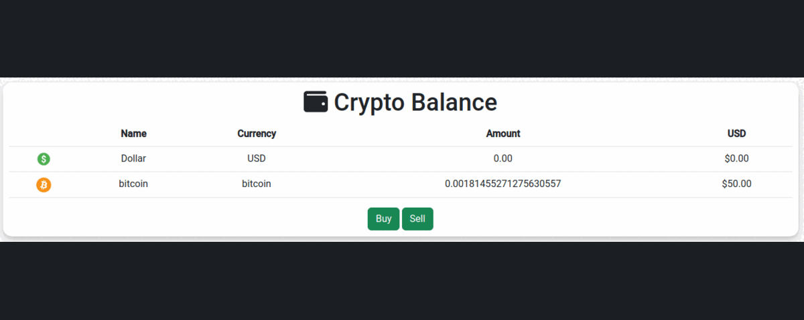

# **Investosphere**

## **Overview**

Investosphere is a virtual investment platform that allows users to simulate and plan their cryptocurrency investments without using real money. It provides a safe and risk-free environment for users to practice and experiment with various investment strategies in the cryptocurrency market.

[Investosphere Live Website](https://investosphere-d74500c2a8ca.herokuapp.com/) (Right-click to open in a new tab)

## **Project Goals**

This is my fourth  portfolio project, showcasing my proficiency in web development frameworks like Bootstrap and Django. My objective with this project is to demonstrate how I can leverage these skills effectively. I have chosen to create a cryptocurrency-focused website that integrates with real-time market data using external APIs.

The website will serve as a platform for users to explore, simulate, and plan cryptocurrency investments without using real money. It aims to provide a safe and educational environment for users to develop and refine their investment strategies. This project reflects my commitment to combining technical expertise with real-world applications, offering users a valuable tool for cryptocurrency investment planning and education.

## **Contents**

## **UX**

## **The Strategy Plane**
Investosphere aims to unite cryptocurrency enthusiasts, providing them with a platform to explore the world of cryptocurrencies comprehensively. Users will have the opportunity to simulate cryptocurrency investments, access market data, and refine their investment strategies. They can review and analyze crypto trends, create and manage virtual portfolios, and gain insights into the cryptocurrency market.

The platform's user-friendly design and visually appealing interface ensure an engaging and educational experience for users as they navigate the world of cryptocurrency investments. The primary goal is to empower users with the knowledge and tools they need to make informed investment decisions, all in a risk-free and supportive environment.

### **The Ideal User**
- Enthusiasts of cryptocurrencies and blockchain technology.
- Individuals interested in exploring cryptocurrency investments.
- Users looking to gain practical experience in cryptocurrency trading without using real money.
- Those who want to build and refine their cryptocurrency investment strategies.
- Users seeking to access market data and stay informed about cryptocurrency trends.
- Investors who value a secure and risk-free environment for investment planning and education.
- Individuals who want to create and manage virtual cryptocurrency portfolios.
- Users who enjoy analyzing crypto market data and making informed investment decisions.
- Anyone looking to engage with a community of like-minded cryptocurrency enthusiasts for sharing insights and experiences.

### **Site Goals**

- To offer users a platform to explore cryptocurrencies, both familiar and new.
- To enable users to simulate cryptocurrency investments and gain hands-on experience.
- To empower users with the tools to refine their cryptocurrency investment strategies.
- To provide users with access to real-time cryptocurrency market data.
- To create a secure and risk-free environment for cryptocurrency investment planning and education.
- To facilitate the creation and management of virtual cryptocurrency portfolios.
- To support users in making informed investment decisions based on data and analysis.

- [Back to top &uarr;](#contents)

## **Agile Planning**

This project was developed using agile methodologies, focusing on delivering small features across the project's duration. User Stories were prioritized under the labels "Must Have," "Should Have," and "Could Have."

This approach ensured that all essential requirements were addressed initially, providing a comprehensive foundation for the project. In certain cases, some "Could Have" features were implemented ahead of schedule, particularly if they were straightforward, such as Trending/Top Rated Movies. Other features were integrated based on available capacity and timing.

The project utilized a Kanban board created on Github projects, which can be accessed [here](https://github.com/users/Danvm94/projects/4). This board provided detailed information about project cards. All User Stories included a set of acceptance criteria to define the functionality required for story completion.

## **The Skeleton Plane**
#### **Wireframes**
For this project, wireframes were created using Balsamiq. While wireframes were developed primarily for the home page, the design for other pages naturally evolved from the base.html template and certain elements of the home webpage.

The wireframes served as a visual guide to outline the layout and structure of the home page, providing a clear representation of the overall design and user interface. This approach allowed for flexibility in designing additional pages, ensuring consistency in the user experience throughout the project.

Desktop

mobile

#### **Database Schema**

The database schema for this project includes the following models:

- The **Crypto** model stores information about cryptocurrencies.
  - Fields:
    - `name`: CharField for storing the name of the cryptocurrency (unique).
- The **Wallet** model represents user wallets, linked to the built-in User model. Each wallet contains information about the user's available dollars, and a timestamp of creation.
  - Fields:
    - `user`: One-to-One relationship with the User model.
    - `dollars`: Decimal field for storing dollar amounts.
    - `created_at`: Timestamp for creation.

- The **Cryptos** model represents cryptocurrency holdings of users, linked to the User model and the Crypto model. It stores information about the user's cryptocurrency holdings and the specific cryptocurrency's symbol.
  - Fields:
    - `user`: ForeignKey relationship with the User model.
    - `crypto`: ForeignKey relationship with the Crypto model.
    - `amount`: Decimal field for storing the cryptocurrency amount.
  - Additional Methods:
    - `formatted_amount`: Formats the cryptocurrency amount for display.
    - `symbol`: Property for retrieving the cryptocurrency's name.

- The **Transactions** model tracks user transactions, including deposits and withdrawals. It contains information about the user, transaction type, symbol, amount, and creation timestamp.
  - Fields:
    - `user`: ForeignKey relationship with the User model.
    - `type`: CharField for the transaction type.
    - `symbol`: CharField for the symbol (e.g., 'dollar').
    - `amount`: Decimal field for storing the transaction amount.
    - `created_at`: Timestamp for creation.
  - Additional Methods:
    - `formatted_amount`: Formats the transaction amount for display.

This schema defines the structure of your project's database, facilitating the management of user wallets, cryptocurrency holdings, and transaction records.

#### **Security Measures**

Security is a top priority in the development of this project. Several security measures have been implemented to protect user data and sensitive information.

- **User Authentication**

To ensure that only authorized users access certain views and functionalities, the Django `@login_required` decorator has been applied. This means that specific views can only be accessed by registered and authenticated users. If an unauthenticated user attempts to access such views, they will be automatically redirected to the login page.

- **Protection of Sensitive Data**

To safeguard secret keys, API keys, and other sensitive information, environment variables have been utilized. During local development, these variables are stored in an `env.py` file, ensuring that no confidential data is exposed in the project repository. In the production environment (e.g., on Heroku), these variables are securely managed through Heroku's config vars.

These security measures are in place to provide a safe and reliable user experience while protecting sensitive information from unauthorized access.

[Back to top &uarr;](#contents)

### **The Scope Plane**

- **Responsive Design:** The site should be fully functional on all devices, ranging from 320px width and up.
- **Hamburger Menu:** Implement a mobile-friendly hamburger menu for improved navigation on mobile devices.
- **CRUD Functionality:** Users should have the ability to Create, Read, Update, and Delete wallet and cryptos.
- **Role-Based Access:** Implement role-based access control, allowing specific features like website's crypto manage for authorized users.
- **Home Page:** Design a home page that provides an overview of the site's purpose, with convenient links to essential features for registered users.

[Back to top &uarr;](#contents)

## **The Structure Plane**

### **Features**
**Navbar**

The Navbar contains links for various sections of the website, each with specific visibility conditions:

- **Home** (index.html): Visible to all users.
- **Login** (login.html): Visible to all users.
- **Wallet** (wallet.html): Visible only to logged-in users.
- **Cryptos** (crypto.html): Visible only to logged-in users.
- **Chart** (chart.html): Visible only to logged-in users.
- **Manage** (manage.html): Visible only to logged-in users with staff privileges.

These navigation items ensure that users have access to the relevant sections based on their authentication status and roles.

[Back to top &uarr;](#contents)

**Footer**

The footer section is thoughtfully positioned at the bottom of each page, providing a cohesive and user-friendly experience.

- **Social Media Links:** Social media links are elegantly displayed using icons from Font Awesome. These icons offer a seamless way for users to connect with the developer, stay updated with news, and engage with the community.

- **Copyright/Disclaimer:** A concise portion of text serves as a Copyright and Disclaimer notice. It's the place where users can access essential information while interacting with the website.

[Back to top &uarr;](#contents)

**Homepage**

The homepage of InvestoSphere welcomes users with a well-structured layout designed to provide a comprehensive experience. It's divided into three primary sections:

- **Welcome Section:** The "Welcome" section serves as the initial introduction to the website. It offers a brief and inviting overview of InvestoSphere's mission and purpose. This section sets the tone for the user's journey through the world of cryptocurrency investments.

- **Market Cap Section:** In the "Market Cap" section, users gain access to market data. Here, the top market capitalization cryptocurrencies are prominently featured. Users can quickly assess the performance and trends of these cryptocurrencies, enabling informed decision-making for their investment strategies.

- **Crypto News Section:** The "Crypto News" section provides users with up-to-date information and insights into the world of cryptocurrencies. It serves as a valuable resource for staying informed about market developments, trends, and news articles related to the cryptocurrency landscape.

[Back to top &uarr;](#contents)

**Wallet Page**

The Wallet page on Investosphere provides users with essential tools to manage their financial transactions seamlessly. This page encompasses the following primary functionalities: deposit, withdraw, transaction history.

- **Deposit Functionality:** The "Deposit" functionality empowers users to add funds to their wallet effortlessly. By inputting the desired amount of dollars and confirming the deposit, users can increase their financial resources. This feature ensures that users can conveniently top up their wallet to initiate cryptocurrency purchases.

- **Withdraw Functionality:** The "Withdraw" functionality allows users to make withdrawals from their wallet when needed. Users can specify the withdrawal amount, and upon confirmation, the requested funds are deducted from their wallet balance. This feature ensures flexibility and ease of access to funds for various financial needs.

- **Transaction History:** Alongside deposit and withdraw functions, the Wallet page also provides users with access to their transaction history. Users can review and track their financial activities, ensuring transparency and accountability in their financial management.

[Back to top &uarr;](#contents)

**Crypto Page**

The Crypto page on Investosphere is the user's gateway to cryptocurrency investment and management. This multifaceted page offers essential features, including buying, selling, and transaction history tracking.

- **Buy Cryptos:** The "Buy Cryptos" section empowers users to initiate cryptocurrency purchases. Users can select the cryptocurrency they wish to buy, specify the desired amount, and confirm the purchase. This feature ensures a seamless and secure process for acquiring cryptocurrencies within the platform.

- **Sell Cryptos:** The "Sell Cryptos" functionality allows users to sell their cryptocurrencies when they decide to liquidate their assets. Users can choose the cryptocurrency to sell, enter the amount they want to sell, and confirm the transaction. This feature provides flexibility and convenience for managing cryptocurrency holdings.

- **Transaction History:** The Crypto page also provides users with access to their transaction history, ensuring transparency and accountability. Users can review and track their cryptocurrency-related activities, including purchases and sales. This feature enables users to maintain a comprehensive record of their cryptocurrency transactions.

[Back to top &uarr;](#contents)

**Chart Page**

The Chart page on InvestoSphere offers users a dynamic and interactive view of daily cryptocurrency prices. This page provides valuable insights into the performance of various cryptocurrencies, allowing users to make informed investment decisions.

- **Cryptocurrency Price Chart:** The centerpiece of the Chart page is the Cryptocurrency Price Chart. This interactive chart displays daily price data for each cryptocurrency available on the platform. Users can select specific cryptocurrencies to display or hide, tailoring the chart to their preferences.

- **Customization Options:** InvestoSphere's Chart page offers customization options to enhance the user experience. Users can choose which cryptocurrencies to include in the chart view, enabling them to focus on specific assets of interest. This feature empowers users to track the performance of their chosen cryptocurrencies with precision.

[Back to top &uarr;](#contents)

**Manage Page**

The 'Manage' page on InvestoSphere is a restricted area accessible only to staff members. This specialized page empowers staff to maintain and manage the cryptocurrency offerings available throughout the website. It offers two essential functions:

- **Add New Cryptocurrency Availability:** Staff members can leverage the 'Add New Cryptocurrency' feature to introduce new cryptocurrencies to the platform. This functionality ensures that the website remains up-to-date with the latest crypto assets. Staff can provide essential information about the new cryptocurrency, making it available for users to explore, invest in, and track.
