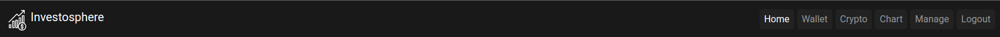
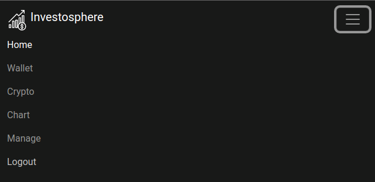
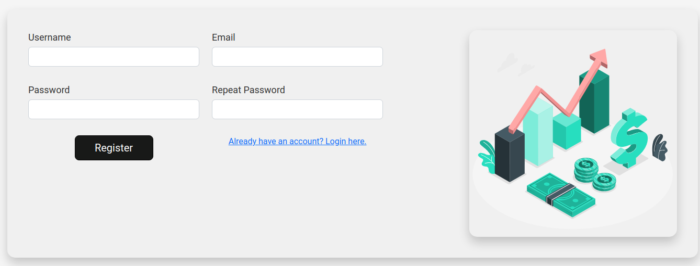
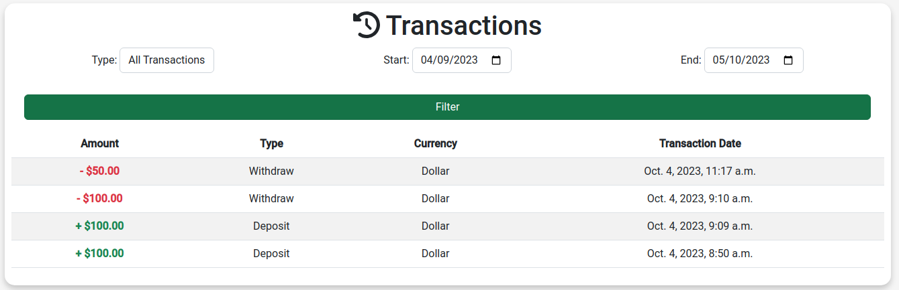
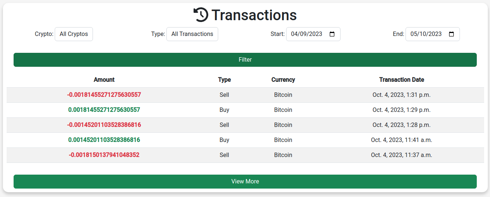
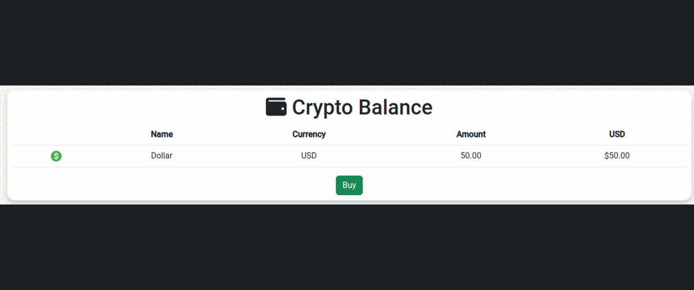
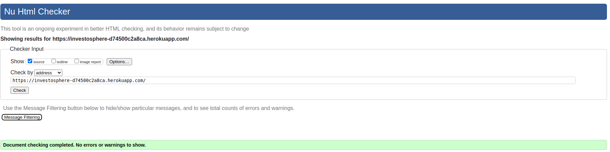

# **Investosphere Testing**

## **Testing Overview**

Extensive testing was conducted throughout the development process, involving
both individual and peer assessments. This rigorous testing approach ensured
the reliability and functionality of the Investosphere platform.

## **Contents**

- [**Testing Overview**](#testing-overview)
- [**Contents**](#contents)
    - [**Automated Testing**](#automated-testing)
        - [**Unit Testing**](#unit-testing)
            - [**investo_hub/tests/test_chart**](#investohubteststestchart)
            - [**investo_hub/tests/test_cryptos**](#investohubteststestcryptos)
            - [**investo_hub/tests/test_forms**](#investohubteststestforms)
            - [**investo_hub/tests/test_models**](#investohubteststestmodels)
            - [**investo_hub/tests/test_transactions**](#investohubteststesttransactions)
            - [**investo_hub/tests/test_views**](#investohubteststestviews)
            - [**user_management/tests/test_crypto**](#usermanagementteststestcrypto)
            - [**user_management/tests/test_forms**](#usermanagementteststestforms)
            - [**user_management/tests/test_models**](#usermanagementteststestmodels)
            - [**user_management/tests/test_newsapi**](#usermanagementteststestnewsapi)
            - [**user_management/tests/test_views**](#usermanagementteststestviews)
        - [**Site Coverage Report**](#site-coverage-report)
    - [**Manual Testing**](#manual-testing)
        - [**User Story Testing**](#user-story-testing)
            - [**Homepage**](#homepage)
            - [**Navbar**](#navbar)
            - [**User Registration**](#user-registration)
            - [**User Login**](#user-login)
            - [**Website Footer**](#website-footer)
            - [**Heroku Deployment**](#heroku-deployment)
            - [**Wallet Feature**](#wallet-feature)
            - [**Crypto Page**](#crypto-page)
            - [**Crypto Page - Buy and Sell Cryptocurrencies**](#crypto-page---buy-and-sell-cryptocurrencies)
            - [**Chart Page**](#chart-page)
            - [**Manage Page**](#manage-page)
        - [**Javascript Testing**](#javascript-testing)
            - [**allowOnlyLetters**](#allowonlyletters)
            - [**fadeOutAndHideElementsAutomatically**](#fadeoutandhideelementsautomatically)
            - [**initializeNewsCarousel**](#initializenewscarousel)
            - [**cryptoCalculator**](#cryptocalculator)
            - [**usdCalculator**](#usdcalculator)
            - [**cryptoPriceRequest**](#cryptopricerequest)
            - [**usdFormatter**](#usdformatter)
            - [**toggleRow**](#togglerow)
            - [**initializeConfirmation**](#initializeconfirmation)
        - [**Validators**](#validators)
            - [**CI Python Linter**](#ci-python-linter)
            - [**W3C CSS Validator**](#w3c-css-validator)
            - [**W3C Markup Validator**](#w3c-markup-validator)
    - [**Responsiveness**](#responsiveness)
    - [**Bugs & Fixes**](#bugs--fixes)
        - [**JSHint**](#jshint)
        - [**PEP8**](#pep8)
        - [**Lighthouse**](#lighthouse)

## **Automated Testing**

### **Unit Testing**

#### **investo_hub/tests/test_chart**

- Command: `python3 manage.py test investo_hub.tests.test_chart`
- Found 3 test(s).
- Creating test database for alias 'default'...
- System check identified no issues (0 silenced).
- ...
- Ran 3 tests in 0.001s
- **Result:** OK
- Destroying test database for alias 'default'...

[Back to top &uarr;](#contents)

#### **investo_hub/tests/test_cryptos**

- Command: `python3 manage.py test investo_hub.tests.test_cryptos`
- Found 11 test(s).
- Creating test database for alias 'default'...
- System check identified no issues (0 silenced).
- ...........
- Ran 11 tests in 25.282s
- **Result:** OK
- Destroying test database for alias 'default'...

[Back to top &uarr;](#contents)

#### **investo_hub/tests/test_forms**

- Command: `python3 manage.py test investo_hub.tests.test_forms`
- Found 14 test(s).
- Creating test database for alias 'default'...
- System check identified no issues (0 silenced).
- .....15.0 > 10 = True
- .5.0 > 10 = False
- .....1000.0
- .1000.0
- .1000.0
- .
- Ran 14 tests in 0.614s
- **Result:** OK
- Destroying test database for alias 'default'...

[Back to top &uarr;](#contents)

#### **investo_hub/tests/test_models**

- Command: `python3 manage.py test investo_hub.tests.test_models`
- Found 11 test(s).
- Creating test database for alias 'default'...
- System check identified no issues (0 silenced).
- ...........
- Ran 11 tests in 0.011s
- **Result:** OK
- Destroying test database for alias 'default'...

[Back to top &uarr;](#contents)

#### **investo_hub/tests/test_transactions**

- Command: `python3 manage.py test investo_hub.tests.test_transactions`
- Found 16 test(s).
- Creating test database for alias 'default'...
- System check identified no issues (0 silenced).
- ..........1
- ...0
- .2
- .1
- .
- Ran 16 tests in 0.036s
- **Result:** OK
- Destroying test database for alias 'default'...

[Back to top &uarr;](#contents)

#### **investo_hub/tests/test_views**

- Command: `python3 manage.py test investo_hub.tests.test_views`
- Found 10 test(s).
- Creating test database for alias 'default'...
- System check identified no issues (0 silenced).
- ..1
- .1.00 > 200.00000000000000000000 = False
- .Exception occurred: Cryptocurrency "nonexistent_crypto" not found in the
  cache.
- ..1000.00
- .1000.00
- .1000.00
- 1200.00
- .1000.00
- 1
- 800.00
- .
- Ran 10 tests in 6.948s
- **Result:** OK
- Destroying test database for alias 'default'...

[Back to top &uarr;](#contents)

#### **user_management/tests/test_crypto**

- Command: `python3 manage.py test user_management.tests.test_crypto`
- Found 2 test(s).
- Creating test database for alias 'default'...
- System check identified no issues (0 silenced).
- ..
- Ran 2 tests in 0.002s
- **Result:** OK
- Destroying test database for alias 'default'...

[Back to top &uarr;](#contents)

#### **user_management/tests/test_forms**

- Command: `python3 manage.py test user_management.tests.test_forms`
- Found 4 test(s).
- Creating test database for alias 'default'...
- System check identified no issues (0 silenced).
- ....
- Ran 4 tests in 0.813s
- **Result:** OK
- Destroying test database for alias 'default'...

[Back to top &uarr;](#contents)

#### **user_management/tests/test_models**

- Command: `python3 manage.py test user_management.tests.test_models`
- Found 1 test(s).
- Creating test database for alias 'default'...
- System check identified no issues (0 silenced).
- .
- Ran 1 test in 0.001s
- **Result:** OK
- Destroying test database for alias 'default'...

[Back to top &uarr;](#contents)

#### **user_management/tests/test_newsapi**

- Command: `python3 manage.py test user_management.tests.test_newsapi`
- Found 2 test(s).
- Creating test database for alias 'default'...
- System check identified no issues (0 silenced).
- ..
- Ran 2 tests in 0.002s
- **Result:** OK
- Destroying test database for alias 'default'...

[Back to top &uarr;](#contents)

#### **user_management/tests/test_views**

- Command: `python3 manage.py test user_management.tests.test_views`
- Found 13 test(s).
- Creating test database for alias 'default'...
- System check identified no issues (0 silenced).
- .............
- Ran 13 tests in 6.730s
- **Result:** OK
- Destroying test database for alias 'default'...

[Back to top &uarr;](#contents)

### **Site Coverage Report**

The test coverage for this project currently stands at 68%. While automated
testing has covered a significant portion of the codebase, additional testing
through manual methods will be conducted to ensure comprehensive coverage.

| Name                                                        | Stmts | Miss | Cover |
|-------------------------------------------------------------|-------|------|-------|
| env.py                                                      | 10    | 0    | 100%  |
| investo_hub/__init__.py                                     | 0     | 0    | 100%  |
| investo_hub/admin.py                                        | 0     | 0    | 100%  |
| investo_hub/apps.py                                         | 4     | 0    | 100%  |
| investo_hub/chart.py                                        | 14    | 10   | 29%   |
| investo_hub/cryptos.py                                      | 64    | 34   | 47%   |
| investo_hub/forms.py                                        | 66    | 20   | 70%   |
| investo_hub/migrations/0001_initial.py                      | 8     | 0    | 100%  |
| investo_hub/migrations/0002_rename_symbol_cryptos_crypto.py | 4     | 0    | 100%  |
| investo_hub/migrations/__init__.py                          | 0     | 0    | 100%  |
| investo_hub/models.py                                       | 35    | 12   | 66%   |
| investo_hub/transactions.py                                 | 61    | 46   | 25%   |
| investo_hub/urls.py                                         | 3     | 0    | 100%  |
| investo_hub/views.py                                        | 110   | 92   | 16%   |
| investosphere/__init__.py                                   | 0     | 0    | 100%  |
| investosphere/asgi.py                                       | 4     | 4    | 0%    |
| investosphere/settings.py                                   | 32    | 1    | 97%   |
| investosphere/urls.py                                       | 4     | 0    | 100%  |
| investosphere/wsgi.py                                       | 4     | 4    | 0%    |
| manage.py                                                   | 12    | 2    | 83%   |
| user_management/__init__.py                                 | 0     | 0    | 100%  |
| user_management/admin.py                                    | 1     | 0    | 100%  |
| user_management/apps.py                                     | 4     | 0    | 100%  |
| user_management/crypto.py                                   | 7     | 1    | 86%   |
| user_management/forms.py                                    | 21    | 1    | 95%   |
| user_management/migrations/0001_initial.py                  | 5     | 0    | 100%  |
| user_management/migrations/__init__.py                      | 0     | 0    | 100%  |
| user_management/models.py                                   | 3     | 0    | 100%  |
| user_management/newsapi.py                                  | 14    | 0    | 100%  |
| user_management/registration.py                             | 7     | 0    | 100%  |
| user_management/tests/test_crypto.py                        | 13    | 0    | 100%  |
| user_management/tests/test_forms.py                         | 22    | 0    | 100%  |
| user_management/tests/test_models.py                        | 6     | 0    | 100%  |
| user_management/tests/test_newsapi.py                       | 19    | 0    | 100%  |
| user_management/tests/test_views.py                         | 106   | 0    | 100%  |
| user_management/urls.py                                     | 3     | 0    | 100%  |
| user_management/views.py                                    | 64    | 8    | 88%   |
| TOTAL                                                       | 730   | 235  | 68%   |

[Back to top &uarr;](#contents)

## **Manual Testing**

Several features on the site are exclusively accessible to registered users.
These features include:

- Viewing the chart page for crypto price history
- Accessing the wallet page for deposits, withdrawals, and transaction history
- Exploring the crypto page for buying, selling, and viewing transaction
  history

Please note that if you plan to evaluate the project, an admin username and
password have been provided during project submission. These credentials are
intended to facilitate the verification of the tests that have been conducted
on the 'Manage' page for adding new crypto support through the website

### **User Story Testing**

#### **Homepage**

`
As a user, I want to see a welcoming home page when I visit the platform to understand its purpose and navigate its features.
`

The homepage of this website is designed with three main sections, each serving
a specific purpose:

1. **Welcome Message**: A warm welcome message greets visitors to the site,
   creating a user-friendly and inviting atmosphere.
    - [x] Welcome message is displayed correctly.
      
2. **Crypto Market Cap**: The homepage prominently displays the current
   cryptocurrency market capitalization, providing visitors with up-to-date
   financial information.
    - [x] The cryptocurrency market cap is accurately shown.
      
3. **Crypto News**: The latest cryptocurrency news articles are featured on the
   homepage, ensuring that visitors have access to the most recent and relevant
   information in the crypto world.
    - [x] Crypto news articles are presented correctly.
      

#### **Navbar**

`
As a user, I want a top navigation bar on the website for easy access to different sections.
`

1. **Responsive Design**: The navigation bar is displayed at the top of every
   page and is responsive to different screen sizes.
    - [x] Implemented and responsive on all screen sizes.

2. **Navigation Links**: The navigation bar includes links to relevant
   sections, such as Home, About, Services, and Contact.
    - [x] Links to Home, About, Services, and Contact sections are included.

3. **Mobile Menu**: On smaller screens, the navigation bar collapses into a "
   hamburger" menu for improved mobile usability.
    - [x] "Hamburger" menu is implemented for smaller screens.

4. **Active Link Highlighting**: The active link is visually distinguished from
   other links.
    - [x] Active link is highlighted for better user experience.

5. **Consistent Design**: The navigation bar maintains a consistent design
   throughout the site.
    - [x] Design is consistent across all pages.

#### **User Registration**

`As a user, I want the option to register for an account so that I can access the platform's features.`

1. **Registration Form**: A user-friendly registration form is available on the
   website.
    - [x] Registration form is designed and accessible.

   

2. **Form Fields**: The registration form includes fields for username, email,
   and password.
    - [x] Fields for username, email, and password are present.

   

3. **Submission**: Users can submit the registration form by clicking the "
   Register" button.
    - [x] "Register" button is provided for form submission.

4. **Success Message**: Upon successful registration, the user receives a
   confirmation message.
    - [x] Success message is displayed after successful registration.
      

5. **Prevent Duplicates**: Users cannot register with an already existing
   username or email.
    - [x] System prevents registration with existing username or email.
      

6. **Password Security**: Passwords are securely hashed before being stored for
   enhanced security.
    - [x] Passwords are securely hashed during registration.

#### **User Login**

As a user, I want the option to log in to my account so that I can access the
platform's personalized features.

1. **Login Form**: A user-friendly login form is available on the website.
    - [x] Login form is designed and accessible.
      

2. **Form Fields**: The login form includes fields for username and password.
    - [x] Fields for username and password are present.
      

3. **Submission**: Users can submit the login form to access their accounts.
    - [x] "Login" button is provided for form submission.

4. **Redirect to Dashboard**: Upon successful login, the user is redirected to
   the platform's main dashboard.
    - [x] Successful login redirects the user to the home page.
      

5. **Access Control**: Users can't access authenticated features without
   logging in.
    - [x] Unauthorized access to authenticated features is restricted.

6. **Password Validation**: Passwords are securely compared and validated
   during the login process.
    - [x] Passwords are securely validated during login.

#### **Website Footer**

`As a user, I expect an informative and easily accessible footer to provide me
with essential links and information about the website.`

The website footer meets the following criteria:

1. **Consistent Display**: The footer is consistently displayed at the bottom
   of every page on the website.
    - [x] Footer is present on all pages.

2. **Social Media Links**: Social media icons with links to official social
   media profiles are included in the footer.
    - [x] Social media icons are displayed with functional links.

3. **Copyright Information**: The footer displays the copyright information for
   the website, including the copyright symbol (©), current year, and website
   name.
    - [x] Copyright information is visibly presented.

4. **Responsive Design**: The footer is designed responsively to adapt to
   different screen sizes.
    - [x] Footer layout adapts to various screen sizes.

#### **Heroku Deployment**

`As a Developer, my goal is to ensure a seamless deployment of the website to
Heroku at an early stage. This will allow me to validate the functionality and
verify that all components are operational before proceeding with full-fledged
development. Additionally, this deployment will facilitate ongoing testing
within the production environment.`

1. **Create a New Heroku App**: Set up a new Heroku app to serve as the hosting
   platform for the website.
    - [x] Heroku app is created and configured.
      

2. **Add the Database to the App Resources**: Incorporate the database into the
   app's resources on Heroku.
    - [x] Database is added and configured on Heroku.

3. **Update Heroku Config Vars with Secret Keys**: Configure the Heroku
   environment by adding the required secret keys to the configuration
   variables.
    - [x] Heroku config vars are updated with secret keys.

4. **Enable Automatic Deployment from GitHub**: Establish a connection between
   the Heroku app and the GitHub repository to enable automated deployments.
    - [x] Automated deployments from GitHub to Heroku are set up.

5. **Configure settings.py for Environment Variations**: In the settings.py
   file, set up conditional configurations: use the env.py file for
   development, switch to the OS for deployment, and adjust the database
   section to align with the accurate database URL provided by Heroku.
    - [x] Settings.py is properly configured for environment variations.

#### **Wallet Feature**

`As a user, I want to have a digital wallet where I can manage my balance, add
funds, and withdraw funds as needed.`

1. **Dedicated Wallet Section**: A dedicated section for managing the user's
   wallet is available on the website.
    - [x] The wallet section is accessible.

2. **Display Balance**: The wallet section displays the current balance of the
   user's account.
    - [x] The current wallet balance is visible.
      

3. **Add Funds**: Users can add funds to their wallet using a specified amount.
    - [x] Users can input an amount and successfully add funds to their wallet.
      

4. **Withdraw Funds**: Users can withdraw funds from their wallet, subject to
   available balance.
    - [x] Users can request withdrawals, and the amount is deducted correctly
      from their wallet.
      

5. **Transaction Logging**: Wallet transactions are logged and displayed for
   user reference.
    - [x] Wallet transactions, including deposits and withdrawals, are logged
      and accessible.
      

#### **Crypto Page**

`As a user, I want to view my crypto holdings and transaction history for each
owned cryptocurrency on the "Crypto" page. Additionally, I want the ability to
filter transactions by various criteria.`

1. **Dedicated "Crypto" Page**: A dedicated "Crypto" page is accessible to the
   user.
    - [x] The "Crypto" page is accessible.

2. **Display Crypto Balances**: The page displays the user's crypto balances
   for each owned cryptocurrency.
    - [x] Crypto balances for owned cryptocurrencies are visible.
      

3. **List Crypto Transactions**: Users can view a list of their recent crypto
   transactions, including details like date, type, amount, and transaction
   status.
    - [x] A list of recent crypto transactions is available.
      

4. **Transaction Filtering**: Users can filter crypto transactions by criteria
   such as transaction type (e.g., buys, sells), cryptocurrency type, start
   date, and end date.
    - [x] Transaction filtering is functional for the specified criteria.

5. **Real-time Updates**: The transactions list is updated in real-time to
   reflect the latest transactions.
    - [x] The transaction list updates in real-time.

#### **Crypto Page - Buy and Sell Cryptocurrencies**

`As a user, I want to have the ability to buy and sell cryptocurrencies directly
from the "Crypto" page to manage my crypto holdings conveniently.`

1. **Buy Functionality**:
    - [x] Users can initiate a buy order by specifying the cryptocurrency,
      amount, and purchase price.
    - [x] Buy orders are executed in real-time, updating the user's crypto
      holdings accordingly.
    - [x] Adequate validation checks are in place to prevent invalid buy
      orders.
      

2. **Sell Functionality**:
    - [x] Users can initiate a sell order by specifying the cryptocurrency,
      amount, and selling price.
    - [x] Sell orders are executed in real-time, updating the user's crypto
      holdings accordingly.
    - [x] Security measures are applied to ensure authorized users can sell
      cryptocurrencies.
      

3. **Security and Validation**:
    - [x] Robust security measures are in place to protect user funds and
      transactions.
    - [x] Buy and sell orders are validated to ensure they meet criteria (e.g.,
      sufficient balance, valid amount, reasonable price).

#### **Chart Page**

`As a user, I want to access a "Chart" page where I can visualize and analyze
the historical prices of available cryptocurrencies to make informed investment
decisions.`

1. **Dedicated "Chart" Page**:
    - [x] A dedicated "Chart" page is accessible to the user.
      

2. **Cryptocurrency Selection**:
    - [x] Users can select specific cryptocurrencies to view their historical
      price charts.

3. **Interactive Price Charts**:
    - [x] The page displays interactive and user-friendly price charts for
      selected cryptocurrencies.

4. **Design "Chart" Page**:
    - [x] The "Chart" page is designed with an organized and visually appealing
      layout.
    - [x] The location and style for displaying price charts are determined.

5. **Fetch Historical Price Data**:
    - [x] A data fetching mechanism is implemented to retrieve historical price
      data for available cryptocurrencies.

#### **Manage Page**

`As an administrator, I want access to a "Manage" page where I can add and
remove cryptocurrencies supported on the website to maintain an up-to-date
selection.`

1. **Dedicated "Manage" Page**:
    - [x] A dedicated "Manage" page is accessible to administrators.

2. **Add Cryptocurrency Functionality**:
    - [x] Administrators can add new cryptocurrencies to the website.
    - [x] The user interface allows administrators to input essential
      information such as name.
    - [x] Server-side logic is implemented to add new cryptocurrencies to the
      website's database.
    - [x] Validation checks are in place to prevent invalid entries.
      

3. **Remove Cryptocurrency Functionality**:
    - [x] Administrators can remove cryptocurrencies from the website.
    - [x] The user interface enables administrators to select cryptocurrencies
      from the existing list to remove.
    - [x] Server-side logic is implemented to remove cryptocurrencies from the
      website's database.
    - [x] Security measures ensure only authorized administrators can remove
      cryptocurrencies.
      

4. **Design "Manage" Page**:
    - [x] The "Manage" page is designed with an organized and user-friendly
      layout, accessible only to administrators.
    - [x] The location and style for adding and removing cryptocurrencies are
      determined.

5. **Security and Validation**:
    - [x] Input data for adding and removing cryptocurrencies is validated to
      prevent errors or misuse.

### **Javascript Testing**

#### **allowOnlyLetters**

The registration form includes a username field that employs
the `allowOnlyLetters` function for input validation. The purpose of this
validation is to ensure that only letters (alphabetic characters) are allowed
in the username field, disallowing any non-text characters.

Manual testing has been conducted, and it has been verified that
the `allowOnlyLetters` function functions correctly, preventing the entry of
non-text characters in the username field as intended.

This validation enhances the security and user experience of the registration
process by ensuring that usernames consist only of alphabetic characters.

- [x] Pass

#### **fadeOutAndHideElementsAutomatically**

The `fadeOutAndHideElementsAutomatically` function, responsible for
automatically hiding success messages after a specified delay with a fade-out
animation.

- [x] Pass

#### **initializeNewsCarousel**

The `initializeNewsCarousel` function, integrated as part of the Bootstrap
framework, serves the purpose of initiating a carousel-style display for the
news section, optimized for mobile devices. This functionality enhances the
user experience by providing an interactive and visually appealing way to
navigate through news content on smaller screens.

- [x] Pass

#### **cryptoCalculator**

The `cryptoCalculator` feature is seamlessly integrated into the crypto
purchase modal, offering users a dynamic way to calculate the amount of
cryptocurrency they can acquire for a specific USD amount. This real-time
calculator instantly updates the crypto price based on the USD value entered by
the user, allowing for precise and convenient cryptocurrency purchases.

- [x] Pass

#### **usdCalculator**

The `usdCalculator` functionality is analogous to the `cryptoCalculator`
with the key difference being that it operates inversely. In this feature,
users have the ability to input a specific cryptocurrency amount, and the
calculator instantly computes the equivalent value in USD. This provides users
with a valuable tool for evaluating their cryptocurrency holdings in terms of
USD currency.

#### **cryptoPriceRequest**

The `cryptoPriceRequest` function is a crucial component of the application's
functionality. Its primary purpose is to fetch the current price of a selected
cryptocurrency and make it available for use in different parts of the
application, particularly within the buy and sell modals.

- [x] Pass

#### **usdFormatter**

The `usdFormatter` function is an essential utility function employed in
various sections of the application, such as deposit and withdraw
functionalities. Its primary purpose is to format numerical values into the
standard USD currency format, enhancing the user experience and ensuring
clarity in financial transactions.

- [x] Pass

#### **toggleRow**

The `toggleRow` function plays a crucial role in enhancing the user experience
within the transaction history section of the application. It facilitates the
expansion and collapse of rows, allowing users to view high transaction volumes
with ease.

- [x] Pass

#### **initializeConfirmation**

The `initializeConfirmation` function is a vital component of our application's
user experience, ensuring that important actions are carried out with the
user's explicit consent. This function plays a key role in confirming user
intent before executing significant tasks, such as buying, selling, depositing,
and withdrawing assets.

- [x] Pass

## **Validators**

### **CI Python Linter**

The [CI Python Linter](https://pep8ci.herokuapp.com/) was employed to validate
the Python code throughout this project. Necessary adjustments have been
implemented to ensure compliance with PEP8 formatting and validations. You can
refer to the following git commit to review the files where these fixes were
applied.

[287f7f04742ae28c12743c82fdddef52528c2d4d](https://github.com/Danvm94/investosphere/commit/287f7f04742ae28c12743c82fdddef52528c2d4d?diff=split)

[Back to top &uarr;](#contents)

### **W3C CSS Validator**

[W3C CSS Validator](https://jigsaw.w3.org/css-validator/) was used to validate
the site's CSS code.

[Back to top &uarr;](#contents)

### **W3C Markup Validator**

All pages were run through
the [W3C Markup Validator](https://validator.w3.org/nu/). Initially, there were
some errors due to missing closing tags, image height values, and Richtextfield
inputs. All of these issues were corrected and all pages passed validation.

Due to the Django templating language code used in the HTML files, these could
not be copied and pasted into the validator and due to the secured views, pages
with login required or a secured view cannot be validated by direct URI. To
test the validation on the files, open the page to validate, right click and
view page source. Paste the raw HTML code into the validator as this will be
only the HTML-rendered code.

[Back to top &uarr;](#contents)

### **JSHint**

[JSHint](https://jshint.com/) was used to validate the Javascript code used in
the project.

The [CI Python Linter](https://pep8ci.herokuapp.com/) was used to validate the
python code used throughout the project. The results are outlined in below:

#### **scripts.js**

#### **chart_view.js**

[Back to top &uarr;](#contents)

### **Lighthouse**

#### Home

#### Wallet

#### Crypto

#### Chart

#### Manage

#### Register

#### Login

## **Responsiveness**

All pages were tested to ensure responsiveness on screen sizes from 320px and upwards. The site was tested on multiple
browsers and devices as outlined below.

| **Browser Tested** | **Actual Result** | **Pass/Fail** |
|--------------------|-------------------|---------------|
| Chrome             | As Expected       | Pass          |
| Firefox            | As Expected       | Pass          |
| Edge               | As Expected       | Pass          |
| Mac OS Safari      | As Expected       | Pass          |

| **Device Tested**    | **Actual Result** | **Pass/Fail** |
|----------------------|-------------------|---------------|
| Mac Air M2           | As Expected       | Pass          |
| HP Elite Laptop      | As Expected       | Pass          |
| HP 23 Monitor        | As Expected       | Pass          |
| Samsung Note 10+     | As Expected       | Pass          |
| Samsung Note 20      | As Expected       | Pass          |
| Samsung S21+         | As Expected       | Pass          |
| Samsung Tab S7+      | As Expected       | Pass          |
| iPhone 13 Pro Max    | As Expected       | Pass          |
| iPhone 11            | As Expected       | Pass          |
| iPad Pro 12 inch     | As Expected       | Pass          |
| One Plus 8T          | As Expected       | Pass          |
| Xiaomi Redmi Note 11 | As Expected       | Pass          |

## **Bugs & Fixes**

### JSHint

During the testing phase with JSHint, several issues were identified in the code and have been addressed to ensure the
code functions correctly. One notable issue was related to the use of Bootstrap in conjunction with a custom JavaScript
script.

One particular issue identified by JSHint was the recognition of the "new" keyword as a warning. While JSHint may
consider it a warning, it is essential to clarify that, in this context, the use of the "new" keyword is a required part
of the code for it to function correctly. The "new" keyword is often used to create instances of objects or classes, and
its absence would lead to erroneous behavior.

To address this issue, a fix has been implemented. You can review the details of this fix by visiting the following Git
commits:

[41e019ab821b259123724f3275836cbbcaea6bed](https://github.com/Danvm94/investosphere/commit/41e019ab821b259123724f3275836cbbcaea6bed)
[48837dc91f0a8e4b3f5d14aaa98ab2511fb036d5](https://github.com/Danvm94/investosphere/commit/48837dc91f0a8e4b3f5d14aaa98ab2511fb036d5)

### PEP8

During the PEP 8 testing, warnings about lines exceeding recommended width were identified. To address these warnings
and maintain code readability, the following Git commit was applied:

[287f7f04742ae28c12743c82fdddef52528c2d4d](https://github.com/Danvm94/investosphere/commit/287f7f04742ae28c12743c82fdddef52528c2d4d)

### Lighthouse

During Lighthouse testing, several adjustments were made to improve performance. You can review these fixes in this Git
commit:

[c22128a37cfedc03fbcb55823d3fc8f3037f36de](https://github.com/Danvm94/investosphere/commit/c22128a37cfedc03fbcb55823d3fc8f3037f36de)

While many Lighthouse test results now show improved performance, it's important to note that some tests may not have
reached a green status yet. This is primarily due to issues such as API loading JPEG images instead of WebP and
potential
delays caused by CDNs when fetching files.